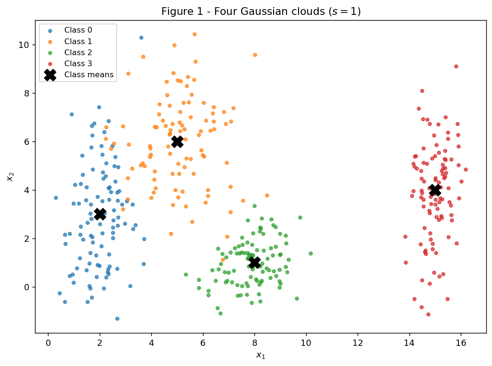
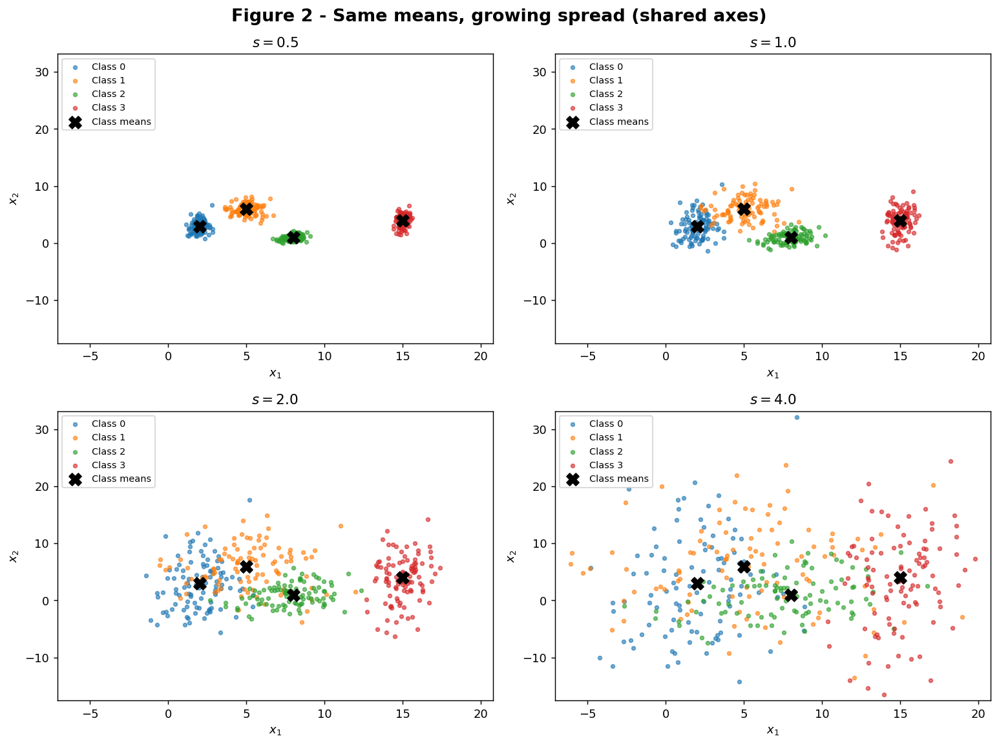
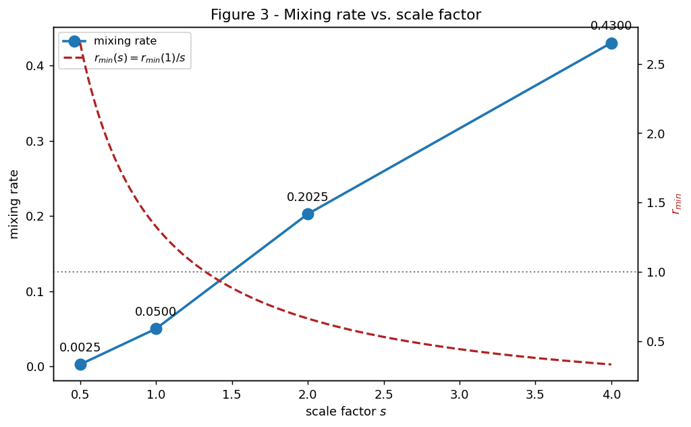
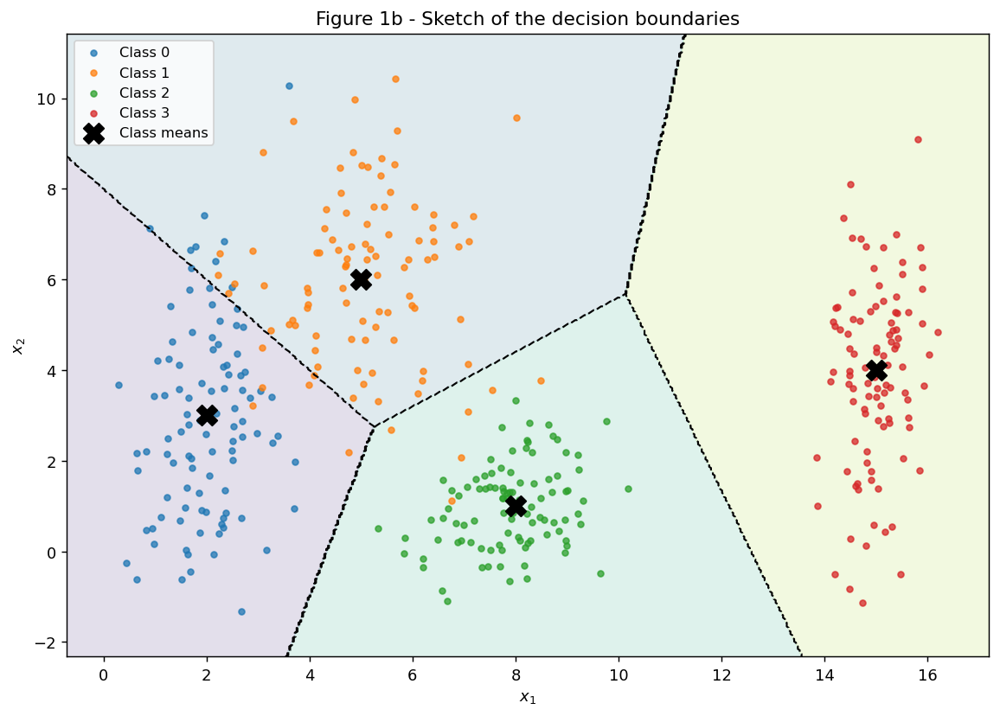
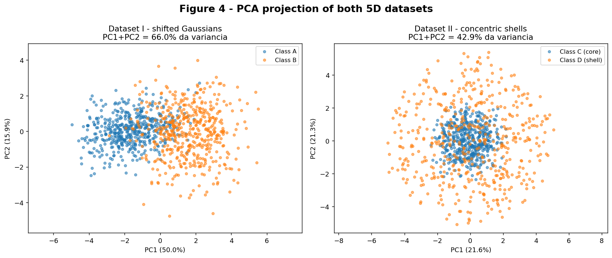
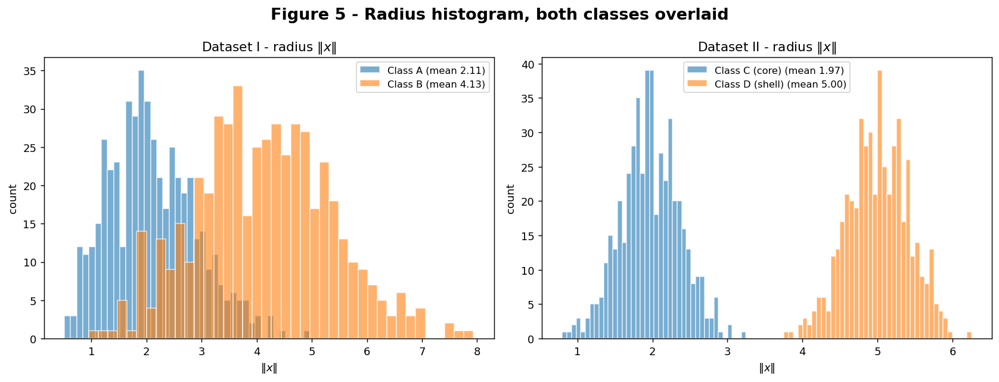
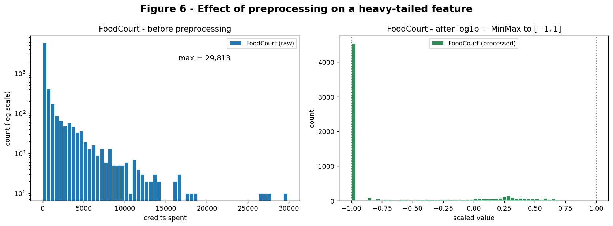

# Exercise 1 — Data

Preparacao e analise de dados para redes neurais. O fio condutor e o **espalhamento**
dos dados: quanto uma nuvem de pontos se espalha, em que direcao, e como isso muda a
dificuldade do problema de classificacao.

Todo sorteio usa `rng = np.random.default_rng(42)`, declarado uma vez no topo de cada
script. Os tres scripts estao em `code/` e sao executaveis de forma independente a
partir de um checkout limpo.

---

## Exercise 1

**Abordagem.** Tudo neste exercicio e geometrico, nada e treinado. As nuvens sao
geradas a partir dos parametros e medidas por duas grandezas: a **razao de separacao**
(distancia entre centros dividida pelo espalhamento das duas nuvens) e a **taxa de
mistura** (fracao de pontos mais proxima de um centro alheio). As duas sao calculadas
em NumPy e indicam, antes de qualquer modelo, o quao dificil e o problema.

```python
--8<-- "docs/exercises/data/code/ex1_point_clouds.py"
```

### A — Generate the clouds

400 amostras, 100 por classe, com as medias e desvios do enunciado. Os centros estao
marcados com um X preto.



### B — More or less spread out

Os quatro datasets sao gerados a partir do **mesmo** ruido padrao, sorteado uma unica
vez, multiplicado por `STD * s`. Assim os paineis mostram as mesmas nuvens dilatando, e
nao quatro sorteios distintos. Os limites dos eixos sao comuns aos quatro paineis.



#### Separation ratio em s = 1

$$ r_{ij} = \frac{\lVert \mu_i - \mu_j \rVert}{\bar{\sigma}_i + \bar{\sigma}_j},
\qquad \bar{\sigma}_k = \frac{\sigma_{k,x} + \sigma_{k,y}}{2} $$

| par | $\lVert \mu_i - \mu_j \rVert$ | $\bar\sigma_i + \bar\sigma_j$ | $r_{ij}$ (s = 1) |
|---|---|---|---|
| **(0, 1)** | 4.2426 | 3.20 | **1.3258** |
| (1, 2) | 5.8310 | 2.45 | 2.3800 |
| (0, 2) | 6.3246 | 2.55 | 2.4802 |
| (2, 3) | 7.6158 | 2.15 | 3.5422 |
| (1, 3) | 10.1980 | 2.80 | 3.6422 |
| (0, 3) | 13.0384 | 2.90 | 4.4960 |

O menor e o par **(0, 1)**, com $r_{01} = 1.3258$. Como as medias nao mudam e todo
desvio e multiplicado por $s$, vale $r_{ij}(s) = r_{ij}(1)/s$. Em $s = 2$ o menor
$r_{ij}$ passa a ser **0.6629**, sem gerar nenhum dado novo.

#### Mixing rate

| $s$ | mixing rate | $r_{min}$ neste $s$ |
|---|---|---|
| 0.5 | **0.0025** | 2.6517 |
| 1.0 | **0.0500** | 1.3258 |
| 2.0 | **0.2025** | 0.6629 |
| 4.0 | **0.4300** | 0.3315 |



**A partir de qual escala as nuvens deixam de ser separaveis por retas?** A partir de
$s = 2$. Ate $s = 1$ a mistura fica em 5%, concentrada numa unica fronteira; em
$s = 2$ ela salta para 20%, ou seja, um em cada cinco pontos ja esta mais perto de um
centro que nao e o da sua classe. Esses pontos nao podem ser recuperados por fronteira
nenhuma, reta ou curva.

O que acontece com o menor $r_{ij}$ nesse ponto e a explicacao do fenomeno: ele cai de
1.3258 em $s = 1$ para **0.6629** em $s = 2$, cruzando o valor 1. Enquanto
$r_{ij} > 1$ os centros estao mais afastados do que a soma dos espalhamentos e existe
um corredor vazio entre as nuvens; abaixo de 1 esse corredor desaparece e as caudas
gaussianas passam a ocupar o mesmo espaco. Em $s = 4$ o menor $r_{ij}$ ja e 0.3315 e a
mistura chega a 43%.

### C — Analysis



**1. Sobreposicao e separabilidade linear.** Em $s = 1$ as classes se misturam num
lugar especifico, nao em geral. Cinco dos seis pares tem $r_{ij}$ acima de 2.3, ou
seja, ficam bem afastados. O unico par apertado e **Classe 0 e Classe 1**, com
$r_{01} = 1.3258$. A Classe 3 e a mais isolada, em torno de $x_1 = 15$.

Uma fronteira linear sozinha **nao** separa as quatro classes. Uma reta divide o plano
em dois pedacos e sao necessarias quatro regioes, entao o problema e de contagem, nao
de encontrar a reta certa.

Um **conjunto** de fronteiras lineares resolve bem. A taxa de mistura em $s = 1$ e
**0.0500**, e esse e aproximadamente o erro que uma separacao por retas cometeria. As
regioes da Figura 1b sao delimitadas por segmentos retos, e uma rede com uma camada
escondida e poucos neuronios reproduz esse formato. Os 5% restantes estao quase todos
na fronteira entre a Classe 0 e a Classe 1.

**2. Esboco das fronteiras.** A Figura 1b mostra a particao por centro mais proximo.
As fronteiras ficam no meio do caminho entre cada par de centros vizinhos,
perpendiculares a reta que os liga — a posicao que deixa a maior folga possivel para
os dois lados quando as nuvens tem espalhamento parecido. Existem pontos onde tres
fronteiras se encontram e as tres classes ficam equidistantes; sao os lugares de menor
confianca do modelo. Onde os desvios sao anisotropicos a fronteira nao fica exatamente
no meio: a Classe 0 tem desvio $[0.8,\ 2.5]$, muito mais espalhada na vertical, o que
empurra a fronteira com a Classe 1 lateralmente. Uma rede tambem arredondaria os
cantos, ja que ativacoes suaves nao produzem quinas.

**3. Relacao com o item B.** O que muda entre as escalas e o tamanho da regiao de
erro, nao a posicao das fronteiras. Como as medias sao fixas, a particao da Figura 1b
vale para todas as escalas — as retas otimas nao dependem de $s$. Muda apenas quantos
pontos caem do lado errado delas.

A imagem util e uma faixa de ambiguidade colada em cada fronteira: a largura dela
cresce com o desvio, ou seja com $s$, enquanto a distancia entre os centros continua
igual. E exatamente isso que $r_{ij}(s) = r_{ij}(1)/s$ mede. O menor $r_{ij}$ cai de
2.6517 em $s = 0.5$ para 0.3315 em $s = 4$, e a taxa de mistura sobe de 0.0025 para
0.4300 no mesmo intervalo.

A consequencia pratica e que, passado certo espalhamento, aumentar a capacidade da
rede nao ajuda. Um modelo mais profundo consegue entortar a fronteira para acertar
pontos especificos do treino, mas esses pontos vem de distribuicoes que realmente se
sobrepoem — a contorcao esta ajustando ruido. O erro de treino cai e o de teste nao,
que e overfitting. Vale registrar que a fronteira otima entre duas gaussianas com
covariancias parecidas ja e uma reta: no regime de alta sobreposicao nao e a
linearidade que limita o desempenho, e a sobreposicao em si.

---

## Exercise 2

**Abordagem.** Dois datasets, ambos em 5 dimensoes e com 500 amostras por classe, mas
construidos sobre principios opostos. O Dataset I separa as classes por **posicao** (os
centros estao deslocados); o Dataset II separa por **raio** (os centros coincidem, as
cascas nao). O contraste mostra que a segunda estrutura e invisivel para qualquer
metodo linear, PCA inclusive, e que essa invisibilidade e uma propriedade da geometria
e nao falta de dados.

```python
--8<-- "docs/exercises/data/code/ex2_nonlinearity.py"
```

### A — Dataset I: shifted Gaussians

Gerado com `rng.multivariate_normal`, que ja embute a correlacao das matrizes de
covariancia. As correlacoes empiricas entre as features 0 e 1 saem **+0.778** para a
classe A e **−0.518** para a classe B, com os sinais esperados. O valor da classe B nao
bate com o $-0.7$ da matriz porque covariancia e correlacao sao grandezas diferentes:
$-0.7 / \sqrt{1.5 \times 1.5} = -0.467$. So coincidem quando a variancia e 1, que e o
caso da classe A.

### B — Dataset II: concentric shells

As direcoes vem de um sorteio gaussiano normalizado, o que da distribuicao uniforme na
esfera unitaria de $\mathbb{R}^5$ (a normal multivariada padrao e rotacionalmente
simetrica). Os raios medios saem em **1.972** para a classe C e **5.005** para a classe
D, contra os alvos 2.0 e 5.0.

### C — Visualize and compare



**Variancia explicada.** Dataset I: PC1 0.5004 + PC2 0.1593 = **0.6597**. Dataset II:
PC1 0.2159 + PC2 0.2132 = **0.4291**.

**Em qual dataset a projecao 2D preserva melhor a informacao relevante?** No
**Dataset I**, com folga. Ali as duas classes tem centros diferentes, entao existe uma
direcao no espaco apontando de uma nuvem para a outra. Essa direcao concentra bastante
variancia justamente porque as classes estao em pontas opostas dela, e como a PCA
procura a direcao de maior variancia, acaba encontrando exatamente essa.

No Dataset II nao existe direcao que funcione. As duas cascas dividem o mesmo centro,
entao qualquer plano de projecao mostra a bola de dentro sobreposta ao anel de fora — a
sombra de uma casca oca e um disco cheio, nao um anel. O ponto decisivo e que o Dataset
II tem variancia explicada **menor** e mesmo assim e o dataset perfeitamente separavel,
como o item D mostra. Variancia explicada e separabilidade sao objetivos diferentes.

**Distancia entre os centros (5D).** Dataset I: **3.2282**, proximo da referencia
teorica $\lVert \mu_B - \mu_A \rVert = 3.3541$. Dataset II: **0.2662**, ruido amostral
em torno de zero, como esperado de duas distribuicoes que compartilham o centro.



Os histogramas de raio invertem o quadro. No Dataset II as medias sao 1.97 e 5.01, com
desvio 0.4 cada — mais de sete desvios de separacao, sem sobreposicao alguma. No
Dataset I as distribuicoes sao largas e se sobrepoem, porque ali o raio nao e a
variavel informativa.

### D — Analysis

**1. Centros coincidentes e histogramas separados.** A distancia entre os centros do
Dataset II e **0.2662**, praticamente zero, enquanto os histogramas de raio estao bem
separados. A combinacao mostra que as classes sao separaveis, mas nao por um
hiperplano.

Um classificador linear so enxerga a projecao dos pontos sobre uma direcao. Como as
duas cascas sao simetricas em torno do mesmo centro, qualquer direcao escolhida projeta
as duas classes uma sobre a outra, sempre centradas em zero. Qualquer reta acerta em
torno de metade dos pontos. O raio, por outro lado, separa perfeitamente. A informacao
esta inteira nos dados, apenas nao numa forma que um modelo linear consiga usar.

**2. Por que mais dados nao resolvem.** O problema nao e falta de amostra, e sim o tipo
de fronteira que o modelo consegue desenhar. Uma fronteira linear em 5 dimensoes divide
o espaco em dois pedacos, e cada pedaco se estende infinitamente em alguma direcao. A
regiao correta aqui e uma casca esferica, que nao tem esse formato. Qualquer fronteira
linear erra, e erra igual com mil ou com um milhao de pontos.

De forma concreta: uma fronteira que englobe toda a classe C, que esta perto da origem,
tambem engloba todos os pontos da classe D que estao do mesmo lado — e D esta espalhada
em todas as direcoes. Nao existe onde colocar a reta. O que resolve e transformar as
features. Trocando os cinco valores de $x$ por $\lVert x \rVert$, o problema vira
unidimensional e um limiar resolve. E isso que as camadas escondidas de uma rede fazem:
constroem features novas antes da parte linear.

**3. Uma projecao PCA misturada prova inseparabilidade?** Nao, e o Dataset II e o
proprio contraexemplo. A PCA e linear — so rotaciona e descarta direcoes. Quando o
grafico dela mostra as classes misturadas, a unica conclusao possivel e que nenhuma
projecao linear em 2D separa. Nada e dito sobre funcoes nao lineares.

A evidencia esta nos resultados acima: o painel direito da Figura 4 mostra as classes C
e D embaralhadas, e ainda assim um corte unico em $\lVert x \rVert$ acerta **1.0000**
dos pontos. Reforca o argumento o fato de o Dataset II ter variancia explicada menor
(0.4291 contra 0.6597 do Dataset I) e mesmo assim ser o dataset separavel.

A assimetria vale ser registrada: um grafico de PCA com classes bem separadas e
evidencia **positiva forte**, porque exibe um separador linear concreto. Um grafico com
classes misturadas e evidencia **negativa fraca**, porque descarta apenas a
separabilidade linear naquela projecao.

**Funcao que separa o Dataset II:**

$$ g(x) = \sum_{i=1}^{5} x_i^2 - \tau^2 $$

Classifica como casca D quando $g(x) > 0$ e como nucleo C quando $g(x) \le 0$. Com
$\tau = 3.5$, o meio do caminho entre os raios 2.0 e 5.0 do enunciado, o resultado e
**1.0000** dos pontos do lado correto. O valor de $\tau$ vem dos parametros e nao de um
ajuste aos dados. A soma dos quadrados foi usada em vez da raiz porque a raiz e monotona
e nao altera a ordenacao, e porque e a forma sugerida pelo enunciado. Note que $g$ e
**quadratica** nos inputs — exatamente o tipo de funcao que um modelo linear nao
expressa.

---

## Exercise 3

**Abordagem.** A ativacao alvo e a `tanh`, que satura fora de aproximadamente
$[-2, 2]$ — alem disso o gradiente e numericamente zero e a unidade para de aprender.
Todo o pipeline tem entao um objetivo: entregar features numa escala limitada e
comparavel, sem NaN e sem caudas extremas. Toda transformacao e ajustada apenas no
conjunto de treino e aplicada aos dois.

```python
--8<-- "docs/exercises/data/code/ex3_preprocessing.py"
```

### A — Get to know the data

**Objetivo do dataset.** A coluna `Transported` indica se o passageiro foi transportado
para uma dimensao alternativa apos a colisao da nave com a anomalia espaco-temporal. E
booleana e e o alvo da classificacao. O balanco entre as duas classes fica praticamente
em 50/50, entao acuracia e metrica justa e nao ha necessidade de reponderacao ou
reamostragem.

**Tipos de feature.** Seis numericas (`Age` e as cinco colunas de gasto), quatro
categoricas (`HomePlanet`, `CryoSleep`, `Destination`, `VIP`) e tres descartadas
(`PassengerId`, `Name`, `Cabin`) por serem identificadores ou texto livre. `CryoSleep` e
`VIP` sao booleanas, mas como tem valores faltantes o pandas as guarda como `object`;
ficam tratadas como categoricas.

**Faltantes.** Nenhuma coluna esta gravemente danificada — todas ficam em torno de 2% —,
mas os buracos estao espalhados por linhas diferentes, de modo que descartar linhas
incompletas eliminaria uma fatia grande do dataset. Imputar e a escolha melhor. A tabela
completa por coluna, em contagem absoluta e percentual, sai no output do script.

**Media x mediana dos gastos.** A mediana das cinco colunas e **0** enquanto as medias
ficam na casa das centenas e os maximos na casa das dezenas de milhares. Tres leituras
decorrem disso. Primeiro, a maioria dos passageiros nao gastou nada — em boa parte sao
os passageiros em criosono, que nao tem como consumir. Segundo, as distribuicoes sao
fortemente assimetricas a direita: media muito acima da mediana e a assinatura classica,
e o desvio padrao fica inflado junto. Terceiro, valores crus nessa escala sao
incompativeis com `tanh` — uma entrada na casa dos milhares satura a unidade
instantaneamente, com derivada zero, e o neuronio morre antes do primeiro passo de
gradiente.

### B — Split before you transform

Split 80/20 estratificado pelo alvo, com `random_state=42`, feito **antes** de qualquer
estatistica.

Toda estatistica usada nas transformacoes e informacao extraida dos dados: a mediana que
preenche uma idade faltante, o minimo e o maximo que reescalam uma coluna, a lista de
categorias conhecida pelo encoder. Calcula-las no dataset inteiro e separar depois faz
com que as linhas de teste influenciem como as de treino sao transformadas, e o teste
deixa de ser um conjunto nao visto. O efeito nao e apenas conceitual: a nota de teste
fica otimista e para de indicar como o modelo se comportaria com passageiros novos. Como
estimar isso e o motivo de existir um conjunto de teste, vazar informacao para dentro
dele anula o proposito da separacao.

A regra seguida daqui em diante e `fit` no treino e `transform` nos dois conjuntos.

### C — Preprocess

**1. Missing data.** Numericas com mediana, porque as colunas de gasto tem cauda longa e
a media seria puxada pelos poucos valores altissimos, preenchendo os faltantes com um
numero que nao representa quase ninguem. Categoricas com a moda, ja que com cerca de 2%
de faltantes por coluna a categoria mais frequente adiciona pouco ruido. Os dois
imputadores sao ajustados somente no treino.

**2. Categorical features.** One-hot com `handle_unknown='ignore'`. Se aparecer uma
categoria no teste que nao estava no treino, o encoder coloca zero em todas as colunas
daquele grupo em vez de levantar erro, e a linha mantem a largura correta. O script
demonstra isso injetando `"Pluto"` em `HomePlanet` numa linha de teste: a soma do bloco
daquela linha fica em 0. Com `handle_unknown='error'` o codigo quebraria no primeiro
valor inedito, o que e ruim porque em producao nao se controla o que chega.

**3. Feature engineering.** `TotalSpend` e a soma das cinco colunas de gasto. Carrega um
sinal que nenhuma coluna isolada tem: se o passageiro consumiu alguma coisa, o que serve
de proxy para o estado de criosono. `Cabin`, `Name` e `PassengerId` sao descartadas.

**4. Heavy tails.** A `tanh` e praticamente linear perto de zero e plana fora de
aproximadamente $[-2, 2]$, com derivada $1 - \tanh^2(z)$ que tende a zero conforme
$|z|$ cresce. Um valor de gasto na casa dos milhares satura a unidade: a saida trava em
$\pm 1$, o gradiente e numericamente nulo e a retropropagacao nao passa sinal. O
neuronio fica morto durante todo o treino.

So reescalar nao resolve. Padronizando uma coluna em que a maior parte da massa esta no
zero e alguns pontos estao em dezenas de milhares, quase todos os dados caem numa fatia
estreita onde a funcao nao discrimina, e os outliers continuam saturando. O problema e a
**forma** da distribuicao, e so uma transformacao nao linear muda forma.

O $\log(1+x)$ comprime a cauda de modo multiplicativo — a diferenca entre 100 e 1.000
creditos passa a valer o mesmo que entre 1.000 e 10.000. Foi escolhido em vez de
$\log(x)$ porque a maioria dos valores e exatamente zero e $\log(0)$ e $-\infty$; o
`log1p` leva 0 em 0, entao o grupo "nao gastou nada" continua sendo um valor unico.

**5. Scaling.** A escolha foi **Normalization para $[-1, 1]$**. Como a `tanh` devolve
valores nesse intervalo, manter a entrada na mesma faixa evita que qualquer valor sature
a primeira camada logo no inicio. A Standardization deixaria o intervalo aberto e um
valor extremo ainda poderia virar um z-score alto o bastante para saturar. A desvantagem
do MinMax e a sensibilidade ao minimo e maximo do treino, contornada aplicando-o depois
do $\log(1+x)$, com a cauda ja comprimida. Os valores minimo e maximo resultantes estao
na linha 13 da Results summary.

### D — Verify and visualize



O eixo y do painel esquerdo esta em escala logaritmica; sem isso a barra dos zeros
domina o grafico e o resto da distribuicao desaparece. Antes, os valores vao de 0 ao
maximo impresso na figura, com quase toda a massa empilhada no zero. Depois do
$\log(1+x)$ e do MinMax, a coluna fica entre $-1$ e $1$, com o pico em $-1$
correspondendo aos passageiros que nao gastaram nada e o restante distribuido ao longo
do intervalo.

**Checagens finais.** O script reporta explicitamente: nenhum NaN nos dois conjuntos,
colunas identicas entre treino e teste, todos os valores finitos, treino dentro de
$[-1, 1]$ e teste dentro de faixa compativel com `tanh`. O shape final e o intervalo de
valores estao nas linhas 12 e 13 da Results summary. O treino atinge exatamente $-1$ e
$1$ porque e assim que o MinMax funciona; o teste pode ultrapassar ligeiramente quando
algum valor la e maior que o maximo visto no treino — comportamento esperado e correto,
ja que cortar o teste para caber no intervalo seria vazamento.

**Qual decisao mais afetaria o treino.** O $\log(1+x)$ nas colunas de gasto. As demais
escolhas sao refinamentos; essa e a que decide se a rede treina ou nao. Essas cinco
colunas sao as mais informativas do dataset, porque gasto esta fortemente ligado ao
estado de criosono, que por sua vez esta ligado ao alvo. Sao tambem as de maior faixa
dinamica. Sem o $\log(1+x)$, qualquer reescala linear preserva a forma da distribuicao:
quase todos os passageiros ficam espremidos num intervalo minusculo onde a `tanh` nao os
distingue, e os poucos valores altos ficam saturados com gradiente zero. As features mais
informativas chegariam a rede no formato menos aproveitavel. Em segundo lugar viria a
escolha do scaling, que define se a primeira camada comeca na regiao responsiva da `tanh`
ou ja saturada. A imputacao e a menos critica das tres — com cerca de 2% de faltantes,
mediana ou media deslocam a acuracia final numa fracao de ponto percentual. Vale uma
ressalva contra a propria escolha feita aqui: imputar `CryoSleep` pela moda descarta um
sinal, ja que `CryoSleep` ausente combinado com gasto zero e indicio razoavel de que o
passageiro estava em criosono. Uma coluna indicadora de "faltante" provavelmente seria
uma pequena melhora.

---

## Results summary

| #  | Item | Your value |
| --- | --- | --- |
| 1  | Mixing rate at $s = 0.5$ | 0.0025 |
| 2  | Mixing rate at $s = 1.0$ | 0.0500 |
| 3  | Mixing rate at $s = 2.0$ | 0.2025 |
| 4  | Mixing rate at $s = 4.0$ | 0.4300 |
| 5  | Smallest $r_{ij}$ at $s = 1.0$, and which pair | 1.3258 — par (0, 1) |
| 6  | Distance between centers — Dataset I | 3.2282 |
| 7  | Distance between centers — Dataset II | 0.2662 |
| 8  | Explained variance PC1 + PC2 — Dataset I | 0.6597 (PC1 0.5004 + PC2 0.1593) |
| 9  | Explained variance PC1 + PC2 — Dataset II | 0.4291 (PC1 0.2159 + PC2 0.2132) |
| 10 | Share of the positive class in `Transported` | PREENCHER |
| 11 | Mean and median of `FoodCourt` on the training set, before transforming | PREENCHER |
| 12 | Final `shape` of the training feature matrix | PREENCHER |
| 13 | Minimum and maximum of the training and test sets after scaling | PREENCHER |
