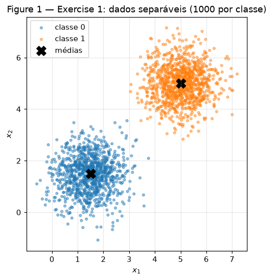
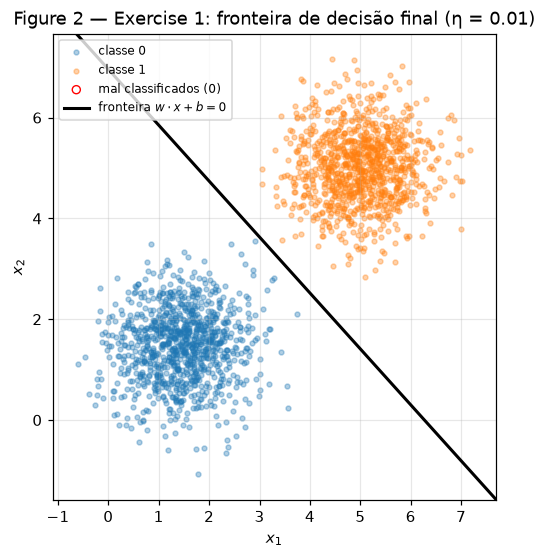
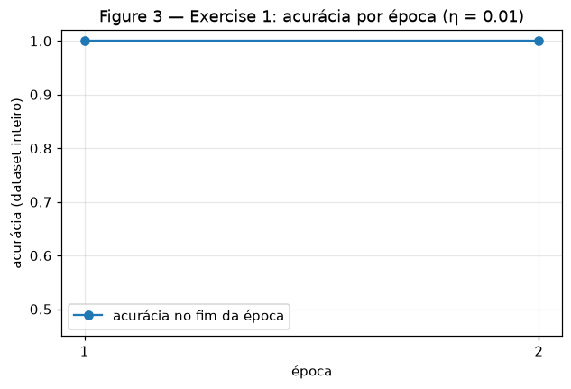
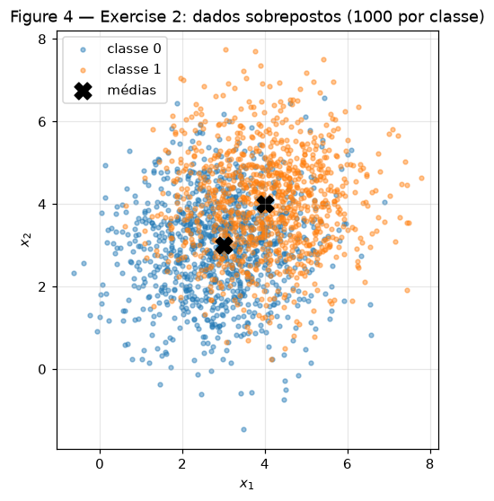
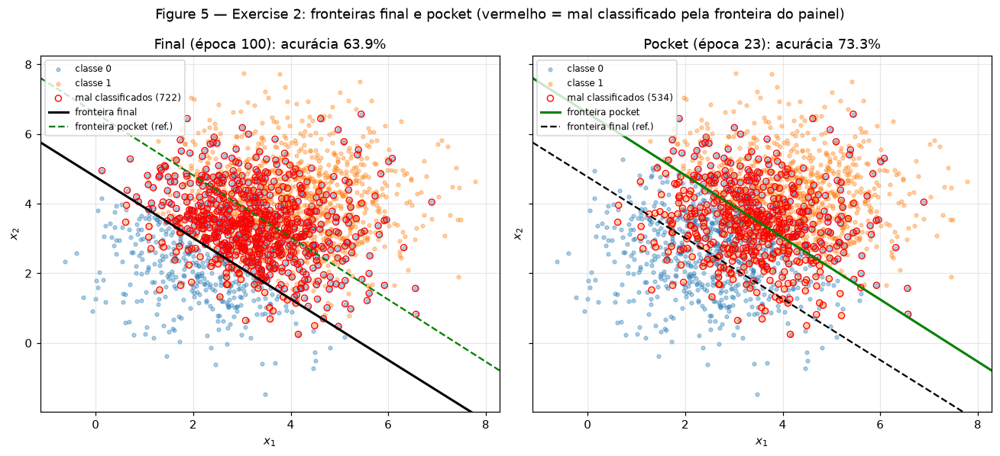
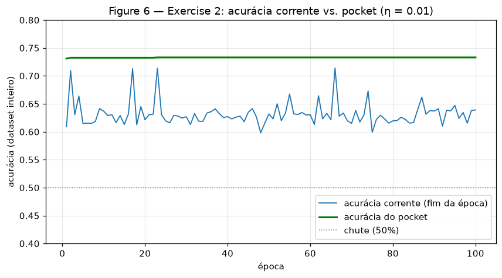

# Exercise 2 — Perceptron

O classificador linear mais simples, testado em dois extremos: dados **linearmente separáveis**, onde o
teorema de convergência vale e o treino termina sozinho, e dados **sobrepostos**, onde nenhuma reta acerta
tudo, o perceptron puro nunca para de se mexer e é preciso guardar os melhores pesos num "bolso" (*pocket*).

**Abordagem.**

- **Tudo escrito à mão em NumPy.** Degrau, previsão, regra de atualização e laço de treino estão em
  [`code/perceptron.py`](code/perceptron.py); os dois exercícios importam a mesma função
  `train_perceptron`, e o Exercise 2 a reutiliza sem nenhuma alteração. `pandas` só monta tabelas e
  `matplotlib` só desenha.
- **Reprodutibilidade.** Cada script declara `rng = np.random.default_rng(42)` no topo, e todo sorteio (dados,
  embaralhamento e pesos iniciais) sai desse gerador. Os scripts rodam de qualquer diretório e regravam as
  figuras em `figures/`.
- **Ordem das amostras.** Cada dataset é embaralhado **uma vez** ao ser criado e a ordem fica fixa durante o
  treino. Sem isso o perceptron veria 1000 pontos de uma classe seguidos de 1000 da outra. Com a ordem fixa,
  as comparações entre execuções (η diferente com o mesmo $\mathbf{w}_0$) são exatas: só muda o que se quer
  comparar.
- **Hiperparâmetros do enunciado.** $\mathbf{w}_0 \sim \mathcal{N}(0,\ 0.01)$ (desvio 0.01), $b_0 = 0$,
  $\eta = 0.01$; o treino para após uma época sem nenhuma atualização ou em 100 épocas. A acurácia é medida no
  dataset inteiro ao fim de cada época.
- **Pocket.** Checado após **cada atualização**, como pede o enunciado: se a acurácia no dataset inteiro
  supera a melhor já vista, $(\mathbf{w}, b)$ é copiado para o bolso. O pocket não altera o treino.

**Dificuldades.** A principal foi de custo: checar o pocket após cada atualização exige avaliar os 2000 pontos
a cada erro, e no Exercise 2 há ~700 erros por época, ou ~70 mil avaliações em 100 épocas. Vetorizar a
avaliação (`X @ w + b` de uma vez) deixa isso em poucos segundos; o laço de atualização continua amostra a
amostra, que é como o perceptron é definido. A outra foi interpretativa: a acurácia final do Exercise 2
depende de *quando* o laço para, então a análise mede onde a fronteira está (ângulo, deslocamento, fração
prevista como classe 1) em vez de só reportar o número.

O mesmo trabalho em formato de notebook, com as saídas, está em
[`code/perceptron_notebook.ipynb`](code/perceptron_notebook.ipynb); ele reproduz exatamente os números abaixo.

---

## Exercise 1

**Separable data.** Script do exercício; a implementação do perceptron que ele importa está no item B.

```python
--8<-- "docs/exercises/perceptron/code/ex1_separable.py"
```

### A — Generate the data

Duas classes com 1000 amostras cada, $\mathcal{N}(\mu, \Sigma)$ com $\Sigma = 0.5\,I$: classe 0 em
$\mu_0 = (1.5,\ 1.5)$, classe 1 em $\mu_1 = (5,\ 5)$. As médias amostrais saíram (1.450, 1.473) e
(5.010, 5.013). A distância entre as médias é $3.5\sqrt 2 \approx 4.95$, contra um desvio de
$\sqrt{0.5} \approx 0.71$ por eixo: cada centro está a ~3.5 desvios da mediatriz, e as nuvens não se tocam.



### B — Implement the perceptron

Modelo e regra de atualização:

$$\hat y = \operatorname{step}(\mathbf{w}\cdot\mathbf{x} + b), \qquad
\operatorname{step}(z) = \begin{cases}1 & z \ge 0\\ 0 & z < 0\end{cases}$$

$$\mathbf{w} \leftarrow \mathbf{w} + \eta\,(y - \hat y)\,\mathbf{x}, \qquad b \leftarrow b + \eta\,(y - \hat y)$$

Como $y - \hat y \in \{-1, 0, +1\}$, só há atualização quando a amostra está errada: um falso negativo
($y = 1,\ \hat y = 0$) soma $\eta\mathbf{x}$ a $\mathbf{w}$, um falso positivo subtrai.

```python
--8<-- "docs/exercises/perceptron/code/perceptron.py"
```

### C — Train and measure

Com $\eta = 0.01$ e $\mathbf{w}_0 = [0.00991,\ -0.00827]$, o treino termina em **2 épocas**: a primeira faz
48 atualizações e já deixa todos os pontos certos; a segunda passa pelos 2000 pontos sem nenhum erro, que é o
critério de parada.

| | valor |
|---|---|
| $\mathbf{w}$ final | [0.03189, 0.02874] |
| $b$ final | −0.20 |
| épocas | 2 (48 atualizações, depois 0) |
| acurácia | **100%** |

A reta $0.03189\,x_1 + 0.02874\,x_2 - 0.20 = 0$ cruza a diagonal em $x_1 = x_2 \approx 3.30$, perto do ponto
médio entre as médias (3.25, 3.25), com normal quase na direção $(1, 1)$. Nenhum ponto mal classificado.





### D — Analysis

**1. Por que converge tão rápido?** A regra só mexe nos pesos quando erra, e cada erro empurra na direção
certa: num falso negativo, $\mathbf{w}\cdot\mathbf{x} + b$ aumenta em $\eta(\lVert\mathbf{x}\rVert^2 + 1) > 0$;
num falso positivo, diminui na mesma quantidade. Quando existe uma reta que separa tudo com folga, o teorema
de convergência (Novikoff) limita o **número total de erros** a $(R/\gamma)^2$, com $R$ o maior
$\lVert\mathbf{x}\rVert$ e $\gamma$ a margem da melhor reta. Aqui a margem é grande em relação a $R$ (nuvens a
~3.5 desvios da mediatriz), então o limite é pequeno: bastaram 48 erros. E, como $\mathbf{w}_0$ é minúsculo, a
direção de $\mathbf{w}$ é dominada logo pelas primeiras correções — somas de pontos da classe 1 menos pontos
da classe 0, que apontam aproximadamente para $\mu_1 - \mu_0 \propto (1, 1)$, já a direção certa.

**2. Reexecução com $\eta = 1.0$** (mesmo $\mathbf{w}_0$, mesma ordem): **2 épocas, acurácia 100%**, com 25
atualizações na primeira época em vez de 48. $\mathbf{w} = [1.717,\ 1.665]$, $b = -11$.

| | $\eta = 0.01$ | $\eta = 1.0$ |
|---|---|---|
| $\mathbf{w}/\lVert\mathbf{w}\rVert$ | [0.7429, 0.6694] | [0.7181, 0.6960] |
| $\lVert\mathbf{w}\rVert$ | 0.043 | 2.392 |
| atualizações | 48, 0 | 25, 0 |

Os pesos ficam ~56× maiores, mas as direções são praticamente iguais: cosseno 0.9993, ângulo de 2.1°.
O que $\eta$ controla é o **tamanho do passo em relação a $\mathbf{w}_0$**, não a geometria da solução. A
fronteira $\mathbf{w}\cdot\mathbf{x} + b = 0$ não muda se $(\mathbf{w}, b)$ for multiplicado por uma constante
positiva, e a regra só usa o **sinal** de $\mathbf{w}\cdot\mathbf{x} + b$. Com $\eta = 0.01$, o $\mathbf{w}_0$
aleatório ($\lVert\mathbf{w}_0\rVert = 0.013$) tem o tamanho de um passo e influencia quais pontos saem errados
no começo; com $\eta = 1$ ele é desprezível desde a primeira correção. Essa é toda a diferença entre as
execuções — daí os 48 vs 25 erros e os 2°.

**3. Partindo de $\mathbf{w} = 0,\ b = 0$, $\eta$ só reescala os pesos.** Sejam $(\mathbf{w}^{(t)}_1, b^{(t)}_1)$
e $(\mathbf{w}^{(t)}_2, b^{(t)}_2)$ os pesos após $t$ amostras nas execuções com $\eta_1$ e $\eta_2$. Hipótese de
indução: $\mathbf{w}^{(t)}_2 = \tfrac{\eta_2}{\eta_1}\mathbf{w}^{(t)}_1$ e $b^{(t)}_2 = \tfrac{\eta_2}{\eta_1} b^{(t)}_1$.

- **Base** ($t = 0$): ambos são zero, então vale com qualquer fator.
- **Passo:** para a amostra $(\mathbf{x}, y)$,
  $\mathbf{w}^{(t)}_2\cdot\mathbf{x} + b^{(t)}_2 = \tfrac{\eta_2}{\eta_1}\left(\mathbf{w}^{(t)}_1\cdot\mathbf{x} + b^{(t)}_1\right)$.
  Como $\eta_2/\eta_1 > 0$, o sinal é o mesmo, logo $\hat y_2 = \hat y_1$ e o erro $e = y - \hat y$ é o mesmo. Então

$$\mathbf{w}^{(t+1)}_2 = \tfrac{\eta_2}{\eta_1}\mathbf{w}^{(t)}_1 + \eta_2\, e\,\mathbf{x}
= \tfrac{\eta_2}{\eta_1}\left(\mathbf{w}^{(t)}_1 + \eta_1\, e\,\mathbf{x}\right) = \tfrac{\eta_2}{\eta_1}\mathbf{w}^{(t+1)}_1,$$

e o mesmo vale para $b$. As duas execuções fazem as mesmas previsões, os mesmos erros, o mesmo número de
épocas, e terminam com pesos que diferem só pelo fator $\eta_2/\eta_1$ — a mesma fronteira.

A verificação numérica no script, com $\eta_1 = 0.01$ e $\eta_2 = 1$: $\mathbf{w}_1 = [0.017074,\ 0.016729]$,
$b_1 = -0.11$; $\mathbf{w}_2 = [1.7074,\ 1.6729]$, $b_2 = -11$. Razão **exatamente 100** nas três coordenadas,
previsões idênticas nos 2000 pontos e as mesmas atualizações por época (25, 0) nas duas.

Com $\mathbf{w}_0 \ne 0$ a indução quebra na base ($\mathbf{w}_0 \ne \tfrac{\eta_2}{\eta_1}\mathbf{w}_0$), e é
isso que produz os 2° do item 2. Note que a execução com $\eta = 1$ do item 2 e a partir de zero do item 3 são
quase iguais ($[1.717,\ 1.665]$ vs $[1.707,\ 1.673]$, ambas com 25 erros): com passo grande, o $\mathbf{w}_0$
pequeno praticamente some.

---

## Exercise 2

**Overlapping data.** Mesma `train_perceptron`, importada sem alteração.

```python
--8<-- "docs/exercises/perceptron/code/ex2_overlapping.py"
```

### A — Generate the data

Duas classes com 1000 amostras cada, $\Sigma = 1.5\,I$: classe 0 em $\mu_0 = (3,\ 3)$, classe 1 em
$\mu_1 = (4,\ 4)$. A distância entre as médias ($\sqrt 2 \approx 1.41$) é menor que a largura de uma nuvem:
cada centro está a só $0.71 / 1.22 \approx 0.58$ desvio da mediatriz. As classes se sobrepõem fortemente e
**nenhuma reta separa os dados**.



### B — Train, keeping the best weights

A mesma função, com $\eta = 0.01$ e um novo $\mathbf{w}_0 \sim \mathcal{N}(0,\ 0.01)$. O treino roda as 100
épocas sem convergir: há entre 658 e 761 atualizações em **toda** época (média 701).

| | $\mathbf{w}$ | $b$ | acurácia |
|---|---|---|---|
| Final (época 100) | [0.07538, 0.08603] | −0.41 | **63.90%** |
| Pocket (época 23) | [0.05678, 0.06367] | −0.42 | **73.30%** |

### C — Figures

Em cada painel, os círculos vermelhos são os pontos que **a fronteira daquele painel** erra; a outra fronteira
aparece tracejada como referência.





### D — Analysis

Para localizar as fronteiras, o script mede a fração dos pontos que cada uma manda para a classe 1, o ângulo de
$\mathbf{w}$ (o ótimo é 45°, na direção $\mu_1 - \mu_0$) e a distância com sinal do ponto médio (3.5, 3.5) até a
reta (o ótimo é 0: a mediatriz passa por ele).

| | prevê classe 1 | ângulo de $\mathbf{w}$ | distância de (3.5, 3.5) à reta | acurácia |
|---|---|---|---|---|
| Final | 81.2% | 48.8° | +1.355 | 63.90% |
| Pocket | 50.1% | 48.3° | +0.019 | 73.30% |
| Reta de Bayes ($x_1 + x_2 = 7$) | — | 45.0° | 0 | 72.60% |

**1. A distância entre final e pocket.** O pocket está no teto do que uma reta consegue: a melhor reta
teórica para essas distribuições acerta $\Phi(\lVert\mu_1 - \mu_0\rVert / 2\sigma) = \Phi(0.577) = 71.8\%$, e
a própria reta de Bayes acerta 72.6% nesta amostra. O pocket fica um pouco acima (73.3%) porque escolhe a
melhor reta *para estes 2000 pontos*. Sua fronteira é praticamente a de Bayes: passa a 0.02 do ponto médio e
divide os pontos meio a meio.

A fronteira final tem quase a **mesma direção** (48.8° contra 48.3°), mas está **deslocada**: passa 1.36
unidades abaixo e à esquerda do ponto médio e por isso manda 81.2% dos pontos para a classe 1. Acerta quase
toda a classe 1 e erra boa parte da classe 0 (Figura 5, painel esquerdo). O erro dela é de *posição*, não de
orientação.

Ela está ali porque, com classes sobrepostas, **sempre** há pontos errados e portanto **sempre** há
atualização. Cada erro mexe em $b$ por $\pm\eta$ e em $\mathbf{w}$ por $\pm\eta\mathbf{x}$: um ponto da classe 1
errado puxa a reta para baixo-esquerda, um da classe 0 para cima-direita. Na região de sobreposição esses
puxões nunca se cancelam de vez, e os pesos ficam **vagando** em torno da solução boa conforme os últimos
pontos vistos. A fronteira da época 100 é só uma fotografia de onde ela estava quando o laço acabou; nada no
algoritmo a leva para a melhor posição. O pocket existe exatamente para isso: não muda o treino, só guarda o
melhor instante da trajetória.

**2. Figuras 3 vs 6 e o teorema de convergência.** Na Figura 3 a curva chega a 100% e o treino para sozinho
(uma época sem erros). Na Figura 6 a acurácia corrente oscila sem tendência entre 59.8% e 71.4% do começo ao
fim, enquanto a do pocket já está em 73.1% ao fim da primeira época e chega a 73.3% na época 23, onde fica.

O teorema de convergência do perceptron garante que, **se existir** $(\mathbf{w}^*, b^*)$ com
$y_i'(\mathbf{w}^*\cdot\mathbf{x}_i + b^*) \ge \gamma > 0$ para todo $i$ (com $y' = \pm 1$), o número total de
atualizações é no máximo $(R/\gamma)^2$: o algoritmo para num número finito de passos, com erro zero. A
hipótese violada é a **separabilidade linear** (margem $\gamma > 0$). Aqui nenhuma reta acerta todos os pontos,
então o teorema não garante nada, e na prática não há ponto fixo: os pesos ciclam indefinidamente. O teorema
também nunca prometeu a reta de *menor erro* quando não existe reta perfeita.

**3. Mais épocas ou $\eta$ menor resolvem?** Não. O script repete o treino por **500 épocas** com o mesmo
$\mathbf{w}_0$ e três valores de $\eta$:

| $\eta$ | acurácia final | corrente nas últimas 100 épocas (mín–máx) | atualizações/época | pocket |
|---|---|---|---|---|
| 1.0 | 63.35% | 59.45% – 71.40% | 700 | 73.40% |
| 0.01 | 66.50% | 59.45% – 71.35% | 700 | 73.35% |
| 0.001 | 63.45% | 59.75% – 66.80% | 701 | 73.35% |

- **Mais épocas:** o critério de parada ("época sem erro") nunca é satisfeito, porque toda época contém pontos
  que nenhuma reta acerta. Uma época a mais é só mais uma volta no mesmo ciclo — em 500 épocas a acurácia
  corrente oscila na mesma faixa que em 100, e a posição final continua sendo onde a reta estiver naquele
  instante.
- **$\eta$ menor:** pelo item 3 do Exercise 1, com $\mathbf{w}_0$ desprezível $\eta$ apenas **reescala**
  $(\mathbf{w}, b)$, e a fronteira só depende da direção de $\mathbf{w}$ e da razão $b/\lVert\mathbf{w}\rVert$.
  Diminuir $\eta$ não deixa os passos menores *em relação aos pesos*, porque os pesos encolhem junto. A
  sequência de erros é quase a mesma, e por isso as três linhas da tabela são tão parecidas. O que faria a
  trajetória assentar seria um passo que **decresce ao longo do treino** (por exemplo $\eta_t \propto 1/t$) ou
  trocar o critério por uma perda contínua (logística, hinge) em vez de reagir só ao sinal. Dentro do
  perceptron puro, o pocket é a correção.

---

## Results summary

| # | Quantity | Value |
| --- | --- | --- |
| 1 | Exercise 1 — final $\mathbf{w}$ and $b$ | $\mathbf{w}$ = [0.03189, 0.02874], $b$ = −0.20000 |
| 2 | Exercise 1 — epochs to convergence | 2 (48 atualizações na 1ª época, 0 na 2ª) |
| 3 | Exercise 1 — final accuracy | 1.0000 (100%) |
| 4 | Exercise 1 — epochs and final accuracy with $\eta = 1.0$ | 2 épocas, 1.0000 (100%) |
| 5 | Exercise 2 — final $\mathbf{w}$ and $b$ | $\mathbf{w}$ = [0.07538, 0.08603], $b$ = −0.41000 |
| 6 | Exercise 2 — accuracy of the final weights | 0.6390 |
| 7 | Exercise 2 — accuracy of the pocket weights | 0.7330 |
| 8 | Exercise 2 — epoch at which the pocket best occurred | 23 |
